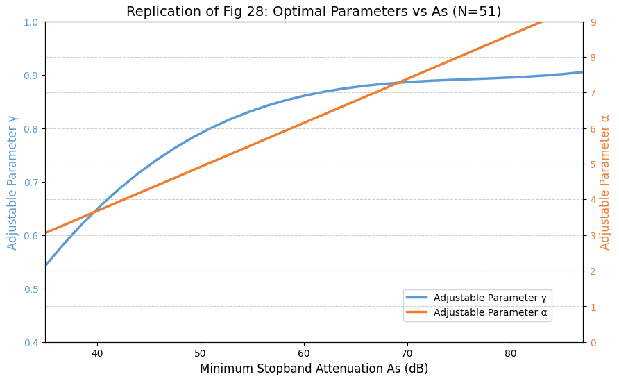
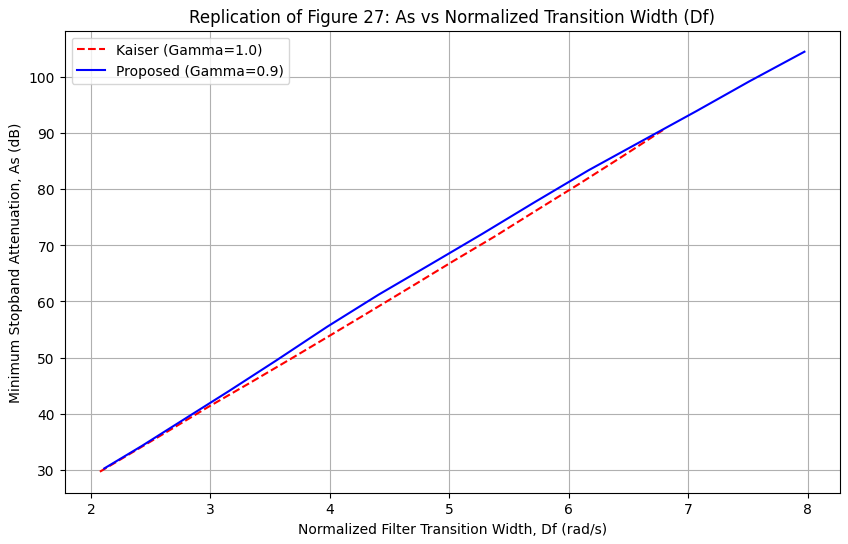
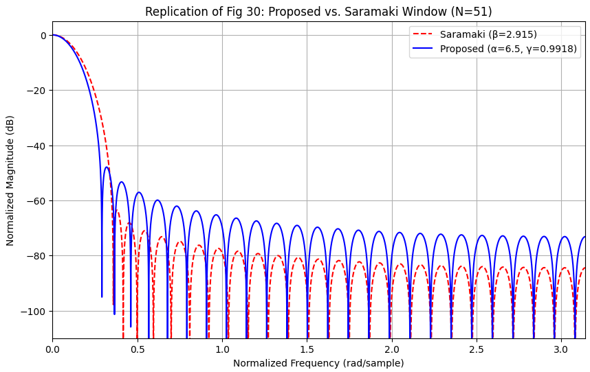

# Fractional Kaiser Window: FIR Filter Design & Implementation

## 專案簡介
本專案為數位訊號處理課程之期末研究，旨在復刻論文：
> **"Fractional Kaiser Window With Application to Finite Impulse Response Digital Filter Design"** {Kemal Avci (İzmir Democracy University), 2024}

## 實作內容
傳統的 Kaiser 窗是數位訊號處理中最常用的可調式窗函數之一 。本專案實作的新型窗函數引入了一個額外的分數階參數 ($\gamma$) ，使其在特定條件下（尤其是 $\gamma < 1$ 時）能提供比傳統 Kaiser 窗更窄的主瓣寬度與更小的波紋比 。

## 實驗結果
1. 觀察圖表，整體數據趨勢皆與論文相同，僅公式函數復刻時有落差導致數據不同
2. 透過圖28可以達到參數alpha gamma最佳化

3.圖27強力證明作者的分數階創新

4.圖30如同作者的創新"分數階凱薩窗不只比傳統凱薩窗好"，還比其他種窗函數還好

## 復盤與心得(Technical Highlights:)
* **$\gamma$ (Fractional Parameter)**：增加 $\gamma$ 會使窗函數變寬，但會提高波紋比 。
* **$\alpha$ (Shape Parameter)**：增加 $\alpha$ 會使窗函數變窄，擴大過渡頻寬並增加阻帶衰減 。
* **$N$ (Length)**：增加 $N$ 會得到更細緻的頻譜特徵 。
